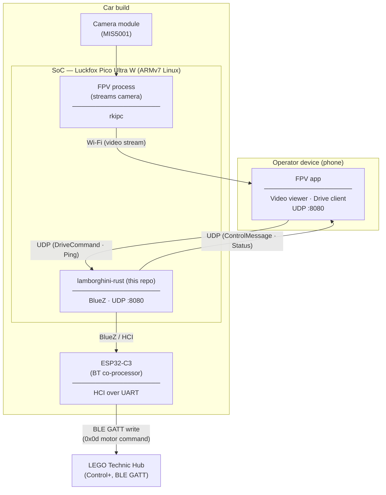

# Lamborghini Rust FPV

An unofficial, open-source Rust controller for the **LEGO Technic Lamborghini 42214** (and other LEGO Control+ hub-based sets), allowing you to drive the car from a Linux SoC such as the [Luckfox Pico Ultra W](https://www.luckfox.com) or another ARMv7/ARM64 Linux device.

The process exposes a small UDP control interface for a companion app and talks to the LEGO hub over Bluetooth Low Energy via BlueZ.

> [!NOTE]
> The Lamborghini 42214 hub is protected by a firmware lock that prevents control through standard third-party tooling. This project uses reverse-engineering and custom BLE commands to bypass that restriction.
> 
> I intentionally did **not** publish the exact handshake sequence. If you want to run this project yourself, you will need to provide `AUTHENTICATION_SEQUENCE` in `src/hub_controller/constants.rs`.

## Architecture



---

## Prerequisites

### Linux (Debian/Ubuntu) — native or on-device

```lamborghini-rust/README.md#L1-2
sudo apt-get update
sudo apt-get install libssl-dev pkg-config libsdl2-dev libdbus-1-dev bluez
```

If you build SDL2 from source through `sdl2-sys`, you may also need a C/C++ toolchain and CMake installed.

### macOS (development only)

```lamborghini-rust/README.md#L1-1
brew install sdl2
```

BLE support in this project depends on BlueZ, so runtime support is Linux-only.

---

## Building

### Native

```lamborghini-rust/README.md#L1-1
cargo build --release
```

### Cross-compiling for ARMv7

The project includes `Cross.toml` and `Cross.Dockerfile` for use with [`cross`](https://github.com/cross-rs/cross):

```lamborghini-rust/README.md#L1-2
cargo install cross
cross build --release --target armv7-unknown-linux-gnueabihf
```

The compiled binary will be written to `target/armv7-unknown-linux-gnueabihf/release/lamborghini-rust`.

---

## Running

Run with the default hub MAC address baked into the binary:

```lamborghini-rust/README.md#L1-1
cargo run --release
```

Or pass the hub MAC address explicitly:

```lamborghini-rust/README.md#L1-1
cargo run --release -- --target 0C:4B:EE:EA:76:F7
```

On the target device after copying the binary:

```lamborghini-rust/README.md#L1-1
./lamborghini-rust --target 0C:4B:EE:EA:76:F7
```

You can also adjust logging verbosity:

```lamborghini-rust/README.md#L1-1
./lamborghini-rust --log-level debug --target 0C:4B:EE:EA:76:F7
```

The application will:

1. Bind a UDP control socket on port `8080`.
2. Search for the configured LEGO hub by Bluetooth MAC address.
3. Connect to the hub, trust it, and discover the required GATT characteristic.
4. Perform the BLE handshake sequence.
5. Forward drive commands from UDP to the hub while broadcasting readiness updates to connected peers.
6. Retry the Bluetooth connection flow if command delivery fails.

## Architecture Notes

There are several decisions that determine the design of this project:

* **Use of UDP on the control plane:** since the app is sending relatively small and frequent control requests to the Bluetooth device and low latency is crucial, a simple protocol like UDP was utilised.
* **Drive command using `watch`:** Accepting only the most recent drive command allows for snappier drive behaviour
* **Separation between Bluetooth manager and hub controller layers:** whereas `BtManager` manages the discovery, pairing, trusted connections, and automatic reconnection, `HubController` manages the discovery and handshaking related to specific hub GATT services and drive command encoding.

## UDP Protocol

The control plane uses `rkyv`-serialized messages over UDP.

### Incoming commands

- `Ping`
- `Drive { speed, steer, mode }`

### Outgoing messages

- `Info(Status { ready })`

### Readiness states

- `WaitingForHub`
- `Connecting`
- `Handshaking`
- `Ready`

---

## License

This project is licensed under the **MIT License**.

> **This project is not affiliated with, endorsed by, or sponsored by the LEGO Group or Sony Interactive Entertainment. All trademarks belong to their respective owners.**
